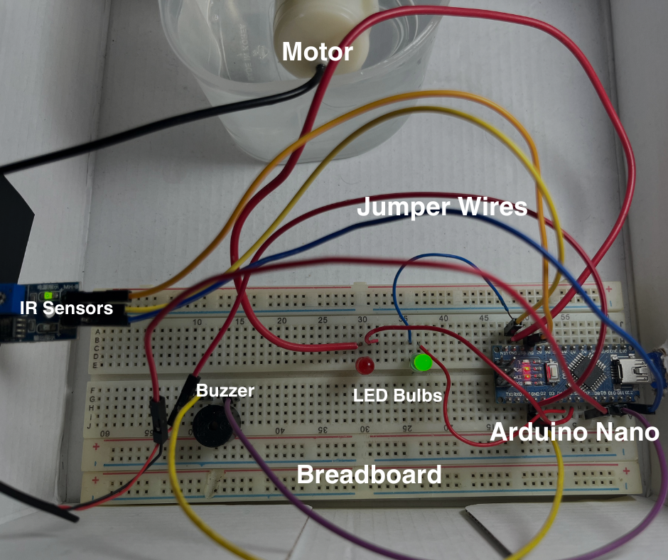
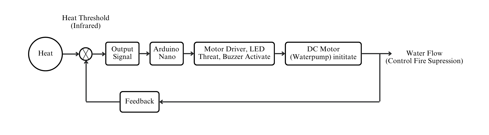

# flame-detection-and-supression-system

Please watch this video to know more about this project: https://youtu.be/YIcbXj1amZk?si=xOzmwvV4LAcSddrc

# Chapter 1: Background

Fire incidents pose a significant threat to life, property, and the environment. Swift and efficient response mechanisms are crucial in minimizing the impact of such events. Traditional fire detection systems are often passive and lack the capability for immediate intervention. The project **"Flame Detection and Fire Suppression System using Arduino Nano"** addresses this limitation by combining real-time flame detection with an automated fire suppression mechanism.

## 1.1 Motivation

The motivation behind this project stems from the need for proactive fire safety measures, especially in environments where rapid response is critical. Conventional fire detection systems often rely on smoke or heat sensors, which may result in delayed responses or false alarms.

## 1.2 Rationale for IR Flame Sensor

The choice of an Infrared (IR) flame sensor is motivated by its sensitivity to the specific wavelengths emitted by flames. This makes it a reliable choice for early flame detection. IR flame sensors are known for their accuracy and responsiveness, enhancing the system's effectiveness.

**Automation and Immediate Response:**

The automation of the system using an Arduino Nano microcontroller ensures a rapid response to flame detection without human intervention. The integration of a water pump or relay for fire suppression provides an immediate and targeted action to mitigate the fire hazard.

# Chapter 2: Components Used

The following components were used in this project:

## 2.1 Arduino Nano

The microcontroller responsible for processing the input from the flame sensor and controlling the output to the buzzer, LEDs, and pump.

## 2.2 Infrared (IR) Flame Sensor

Used for flame detection by measuring infrared radiation. Commonly used for its sensitivity to the specific wavelengths emitted by flames.

## 2.3 Buzzer

An audible alarm device that produces a sound when activated. Used to provide an audible alert in response to flame detection.

## 2.3 LEDs (Light Emitting Diodes)

- **2.3.1 Red LED (red led):** Used to indicate the presence of a flame and the activation of the fire suppression system.
- **2.3.2 Green LED (greenled):** Indicates the normal state when no flame is detected and the system is in standby.

## 2.4 Water Pump (or Relay Mechanism)

The pump or relay is activated in response to flame detection to initiate the discharge of water for fire suppression.

## 2.5 Connecting Wires

Wires are used to establish electrical connections between the components, ensuring a proper circuit.

## 2.6 Power Supply

A suitable power supply is needed to provide the required voltage and current for the Arduino Nano, IR flame sensor, buzzer, LEDs, and the water pump or relay.

## 2.7 Breadboard

Used for assembling and prototyping the circuit before final implementation. Helps in testing and troubleshooting.

# Chapter 3: Flow of Operation

## 3.1 Initialization

The system initializes by setting up the pins for the various components, including the buzzer, LEDs, and the IR flame sensor. Serial communication is initiated for potential debugging and monitoring.

## 3.2 Continuous Monitoring

The program enters the main loop where it continuously monitors the state of the IR flame sensor. The flame sensor, connected to the specified pin (flamePin), constantly reads the infrared radiation in its vicinity.

## 3.3 Flame Detection

If a flame is detected by the IR sensor (Flame == LOW), indicating a potential fire hazard, the system proceeds with the following actions.

## 3.4 Alarm Activation

The buzzer (buzzerPin) is activated to produce an audible alert, signaling the presence of a flame. The red LED (redled) is turned on, providing a visual indicator of the detected flame. Simultaneously, the green LED (greenled) is turned off.

## 3.5 Fire Suppression Activation

In response to the detected flame, the system triggers the pump or relay mechanism to initiate water discharge for fire suppression. This step represents the immediate response mechanism to mitigate the fire hazard.

## 3.6 Status Indication

Visual indicators play a crucial role in communicating the system's status. The red LED remains on during flame detection and fire suppression activation. The green LED is turned off during this phase.

## 3.7 Cooldown Period

To avoid continuous triggering and to allow for a controlled response, a cooldown period may be implemented. This period ensures that the system remains in a standby state for a specified duration after fire suppression activation.

## 3.6 No Flame Detected

If no flame is detected (Flame == HIGH), indicating a safe environment, the system reverts to a standby state. The buzzer is turned off, and the green LED is activated to indicate normal conditions. The red LED is turned off during this phase.

## 3.7 Continuous Monitoring (Loop)

The system continues to loop through the monitoring and response process, providing a continuous and automated fire detection and suppression mechanism. This flow ensures rapid and automated response to the presence of a flame, integrating both audible and visual alerts along with an active fire suppression system to enhance safety measures. The implementation allows for real-time monitoring and intervention, crucial in preventing potential fire-related incidents.

# Chapter 4: Conclusion

## 4.1 Potential Applications

The Flame Detection and Fire Suppression System holds versatile applicability, proving invaluable in diverse environments such as:

- Residential spaces, safeguarding homes from fire hazards.
- Industrial facilities, protecting critical infrastructure and machinery.
- Public areas, where the swift detection of flames is essential for ensuring the safety of occupants and minimizing property damage.

## 4.2 Challenges and Considerations

The project involves addressing nuanced challenges, including:

- Optimization of the IR flame sensor's sensitivity to guarantee accurate and timely flame detection.
- Ensuring the reliability of the water discharge mechanism, requiring meticulous engineering to guarantee effective fire suppression.
- Managing power consumption as a key consideration, aiming to strike a balance between system responsiveness and energy efficiency for prolonged operational reliability.

## 4.3 Future Enhancements

Future enhancements may involve:

- Integrating additional sensors for a comprehensive fire detection approach.
- Implementing wireless communication for remote monitoring.
- Exploring smart algorithms for advanced fire prediction.

In summary, the project is driven by the necessity for a proactive and automated fire safety solution. The integration of IR flame detection with immediate fire suppression, facilitated by the Arduino Nano, marks a significant advancement in the realm of fire safety systems. This background sets the stage for a detailed exploration of the hardware, software, and operational aspects of the Flame Detection and Fire Suppression System.
